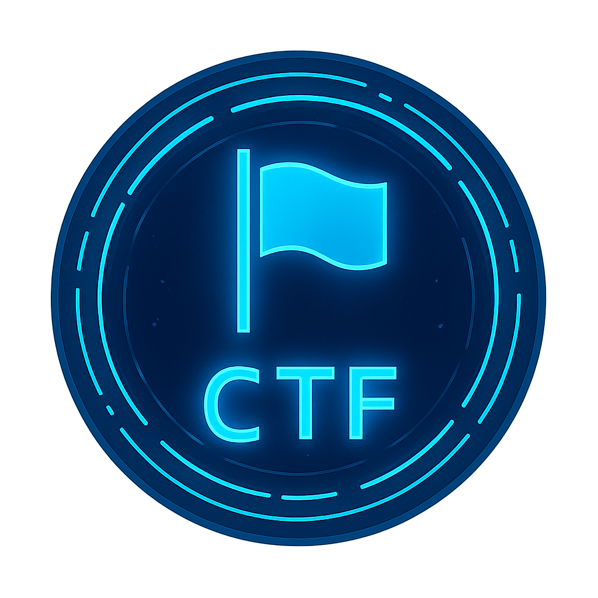
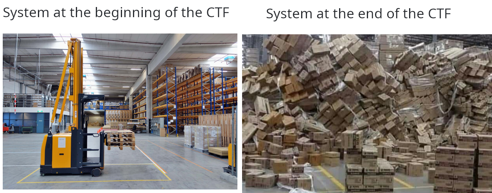

# Capture The Flag VM

<div align="center">
  
</div>

My customized setup to build a  **Debian 12** VM for CTF competitions.

## Why do I need a CTF VM?

**TL;DR** : a meme is worth a thousand words.

<div align="center">
  
</div>

<details>
<summary>Click to see the details</summary>

* Throughout a CTF, you will need a lot of different tools, and you will often need to install new ones.
* To not waste time, it is better to have a pre-configured system with most of the tools you will need. So, preparation is key.
* You will be in a hurry and install shady tools from shady sources. (and probably dissect malwares as challenges)
  * This kind of mindset also often leads to weak/insecure configurations
  * And also errors (e.g. messing up your Python environment).
* I see two solutions to this problem :
  * Either install a fresh OS with all your configurations and tools directly on your machine before each CTF (time-consuming and boring), with the option of creating a disk image to restore it easily (but still time-consuming).
  * Or have a pre-configured VM ready to use, with all the tools you need
    * With a clean state (snapshot) to restore if something goes wrong (taking and restoring snapshots is done instantly and only a few clicks away)
    * Which you can clone to have multiple instances (one per CTF)
    * Which you can easly backup (basically a bunch of files)

</details>

## Prerequisites

*  **Debian 12, GNOME** Virtual Machine (either VirtualBox or VMware Workstation Pro) (see next section)
* User account with sudo privileges
* Internet connection
* A few hours

## Install debian 12 with GNOME

<details>
<summary>Click to expand</summary>

### Install the base system

Just follow the installation steps of the installer. You can use the graphical installer or the text-based installer.

> ⚠️ **WARNING** : Make sure to **remember the username and password** you set during the installation. The most convenient option is to note it on your VM description field in your VM manager. Yes, it is bad practice for real production environments, but an acceptable risk in our case.

### GNOME install

**Option 1 : default GNOME install**

Check "Debian desktop environment" and "GNOME" in the software selection at the end of the installation.
This comes with junk software such as games, which you may uninstall later.

**Option 2 : minimal install and then install GNOME manually** (recommended, cleaner)

<details>
<summary>Click to expand</summary>

* Uncheck "Debian desktop environment" and "GNOME" in the software selection at the end of the installation.
* Reboot at the end of the installation.
* (Optional) Take a snapshot of the VM to avoid reinstalling everything if something goes wrong.
* Login
* Install GNOME :
  ```bash
  sudo apt update
  sudo apt install gnome-core gnome-terminal gnome-session nautilus firefox-esr git wget curl nano -y
  ```
* Reboot, login, open terminal and run :
  ```bash
  sudo apt purge ifupdown -y
  ```
* Configure NetworkManager
  ```bash
  sudo nano /etc/NetworkManager/NetworkManager.conf
  ```
  Set `managed=false` to `managed=true`
* Reboot

*From [Debian Minimal GNOME Install: A Step-by-Step Tutorial - OSTECHNIX](https://ostechnix.com/debian-minimal-gnome-install/)*

</details>

### Install guest additions

* Prerequisites :
  ```bash
  sudo apt install build-essential linux-headers-$(uname -r)
  ```
  Then, in the VM window menu, select the option to install guest additions (VirtualBox) or VMware tools (VMware). Follow the instructions.
* Reboot
* Fix permissions on host-guest shared folders (if used) :
  ```bash
  sudo usermod -aG vboxsf $USER   # VirtualBox
  sudo usermod -aG vmhgfs $USER   # VMware
  reboot
  ```

### Post-installation settings

* Make sure packages are up to date :
  ```bash
  sudo apt update
  sudo apt upgrade -y
  sudo apt dist-upgrade -y
  sudo apt autopurge -y
  ```
* Explore GNOME settings and set as desired, including :
  * Set energy settings to never suspend
  * Set up automatic login (more convenient for a VM)
  * Set wallpaper
  * Set default applications
* Remove/install base programs as desired.
* Enable hidden files in file manager
* Set theme and font in GNOME terminal
* Etc. Take time to customize the base system as desired.
* (Recommended) Clone the VM so you keep a base system for other uses.
* (**Strongly recommended**) Take a snapshot of the VM to avoid reinstalling everything if something goes wrong later.

</details>

## Additional base setup

### Desktop setup

Addons for taskbar and desktop icons

<details>
<summary>Click to expand</summary>

```bash
cd /usr/lib/python3.11
sudo rm EXTERNALLY-MANAGED
sudo apt update && sudo apt install -y python3-pip
pip3 install gnome-extensions-cli

tput reset && source ~/.profile
gnome-extensions-cli install dash-to-dock@micxgx.gmail.com
gnome-extensions enable dash-to-dock@micxgx.gmail.com
gsettings --schemadir ~/.local/share/gnome-shell/extensions/dash-to-dock@micxgx.gmail.com/schemas/ set org.gnome.shell.extensions.dash-to-dock autohide false
gsettings --schemadir ~/.local/share/gnome-shell/extensions/dash-to-dock@micxgx.gmail.com/schemas/ set org.gnome.shell.extensions.dash-to-dock autohide-in-fullscreen false
gsettings --schemadir ~/.local/share/gnome-shell/extensions/dash-to-dock@micxgx.gmail.com/schemas/ set org.gnome.shell.extensions.dash-to-dock intellihide false
gsettings --schemadir ~/.local/share/gnome-shell/extensions/dash-to-dock@micxgx.gmail.com/schemas/ set org.gnome.shell.extensions.dash-to-dock dash-max-icon-size 40
gsettings --schemadir ~/.local/share/gnome-shell/extensions/dash-to-dock@micxgx.gmail.com/schemas/ set org.gnome.shell.extensions.dash-to-dock dock-fixed true
gsettings --schemadir ~/.local/share/gnome-shell/extensions/dash-to-dock@micxgx.gmail.com/schemas/ set org.gnome.shell.extensions.dash-to-dock dock-position 'LEFT'
gsettings --schemadir ~/.local/share/gnome-shell/extensions/dash-to-dock@micxgx.gmail.com/schemas/ set org.gnome.shell.extensions.dash-to-dock extend-height true
gnome-extensions-cli install 2087 # Desktop Icons NG (DING)
```

</details>

### Browsers

*These are personal choices, feel free to change to your liking.*

<details>
<summary>Click to expand</summary>

**[Librewolf](https://librewolf.net/installation/debian/)**

```bash
sudo apt update && sudo apt install extrepo -y
sudo extrepo enable librewolf
sudo apt update && sudo apt install librewolf -y
```

**[Brave](https://brave.com/linux/)**

```bash
sudo apt install curl
sudo curl -fsSLo /usr/share/keyrings/brave-browser-archive-keyring.gpg https://brave-browser-apt-release.s3.brave.com/brave-browser-archive-keyring.gpg
echo "deb [signed-by=/usr/share/keyrings/brave-browser-archive-keyring.gpg] https://brave-browser-apt-release.s3.brave.com/ stable main"|sudo tee /etc/apt/sources.list.d/brave-browser-release.list
sudo apt update
sudo apt install brave-browser
```

</details>

### Update tool

Copy the `scripts` folder to ~/home<br>
Copy `update.desktop` to `/usr/share/applications/`

## General tools

### Base programs

*Lots of useful programs to install in a row.*

<details>
<summary>Click to expand</summary>

```bash
sudo apt update && sudo apt install -y \
    okular ark mousepad eog \
    git curl wget jq \
    build-essential gcc gdb \
    python3-pip python3-venv \
    xxd binwalk qpdf sagemath \
    sqlitebrowser \
    nmap wireshark \
    testdisk # pre-requisite for autopsy
```

* qpdf gives access to the `zlib-flate -uncompress < FILE` command to decompress files compressed with zlib
* sagemath is a "layer on top" of Python for advanced mathematics

</details>

### Miniconda

We will use miniconda to manage Python versions and virtual environments.

<details>
<summary>Click to expand</summary>

```bash
cd /tmp
curl https://repo.anaconda.com/pkgs/misc/gpgkeys/anaconda.asc | gpg --dearmor > conda.gpg
sudo install -o root -g root -m 644 conda.gpg /usr/share/keyrings/conda-archive-keyring.gpg # Install our public GPG key to trusted store
gpg --keyring /usr/share/keyrings/conda-archive-keyring.gpg --no-default-keyring --fingerprint 34161F5BF5EB1D4BFBBB8F0A8AEB4F8B29D82806 # Check whether fingerprint is correct (will output an error message otherwise)
echo "deb [arch=amd64 signed-by=/usr/share/keyrings/conda-archive-keyring.gpg] https://repo.anaconda.com/pkgs/misc/debrepo/conda stable main" | sudo tee -a /etc/apt/sources.list.d/conda.list # Add our Debian repo

sudo apt update
sudo apt install -y conda

source /opt/conda/etc/profile.d/conda.sh
conda init bash
source ~/.bashrc
```

</details>

### Codium

The open-source version of VSCode, without Microsoft telemetry.

<details>
<summary>Click to expand</summary>

```bash
wget -qO - https://gitlab.com/paulcarroty/vscodium-deb-rpm-repo/raw/master/pub.gpg \
    | gpg --dearmor \
    | sudo dd of=/usr/share/keyrings/vscodium-archive-keyring.gpg
echo 'deb [arch=amd64,arm64 signed-by=/usr/share/keyrings/vscodium-archive-keyring.gpg] https://download.vscodium.com/debs vscodium main' \
    | sudo tee /etc/apt/sources.list.d/vscodium.list
sudo apt update && sudo apt install -y codium
```

</details>

### Python modules

*Some useful Python modules for CTFs.*

<details>
<summary>Click to expand</summary>

```bash
pip3 install pycryptodome
pip3 install lxml
pip install sympy
```

</details>

## Forensics tools

### Autopsy

*A tool used in lots of police investigations, supporting a wide range of media formats.*

<details>
<summary>Click to expand</summary>

* Download via the [official site](https://www.autopsy.com/download/)
* Install "The Sleuth Kit Java .deb Debian package" with apt (on the file)
* Follow the guide on github!
* Add the path (.bashrc)
* Create a desktop entry in `/usr/share/applications/autopsy.desktop` (check paths):
    <details>
    <summary>Click to expand</summary>

    ```desktop
    [Desktop Entry]
    Version=1.0
    Name=Autopsy
    Comment=Digital forensics : graphical interface to The Sleuth Kit
    Comment[fr]=Investigation numérique : interface graphique pour The Sleuth Kit
    Exec=/home/jack/autopsy/autopsy-4.22.1/bin/autopsy
    StartupNotify=true
    Terminal=false
    Icon=/home/jack/autopsy/autopsy-4.22.1/icon.ico
    Type=Application
    Categories=Forensics;
    ```
    
    </details>

</details>

## Reverse engineering tools

### IDA Free

*A popular disassembler and debugger.*

<details>
<summary>Click to expand</summary>

* On the project site, [download the latest version](https://my.hex-rays.com/dashboard/download-center/installers/) of IDA Free for Linux.
* Run the installer and follow the instructions.
* Get a license file and put it in the program folder.

</details>

### Ghidra

*A powerful reverse engineering tool made by the NSA.*

<details>
<summary>Click to expand</summary>

* Download the latest version on [NSA's github](https://github.com/NationalSecurityAgency/ghidra/releases)
* Extract the archive in the home folder
* Create a desktop file in `/usr/share/applications/ghidra.desktop` (check paths) :
    <details>
    <summary>Click to expand</summary>
    
    ```desktop
    [Desktop Entry]
    Version=1.0
    Name=Ghidra
    Comment=Ghidra Reverse Engineering Tool
    Comment[fr]=Outil de rétro-ingénierie Ghidra
    Exec=/home/jack/ghidra/ghidraRun
    Icon=/home/jack/ghidra/docs/images/GHIDRA_1.png
    Terminal=false
    Type=Application
    Categories=Reverse;
    ```

    </details>

</details>

### Qu1cksc0pe

*A tool to quickly analyze binaries/malwares and extract useful information.*

* Follow the instructions on the [Github project](https://github.com/CYB3RMX/Qu1cksc0pe).

### pyinstxtractor

*A Python script to extract contents of executables created with PyInstaller.*

<details>
<summary>Click to expand</summary>

Git clone the project in the home folder. (yup, no dependencies)

```bash
cd
git clone https://github.com/extremecoders-re/pyinstxtractor.git
```

</details>

## Cryptography tools

### Ciphey

*An automatic cryptanalysis tool. [[GitHub]](https://github.com/bee-san/Ciphey)*

<details>
<summary>Click to expand</summary>

As the tool only supports Python 3.9, we use conda to create a 3.9 environment.

```bash
conda create -n ciphey python=3.9 -y
conda activate ciphey
pip install ciphey --upgrade
conda deactivate
```

</details>

## Web tools

### Burp Suite

*A popular web security penetration testing tool.*

* Download via the [project site](https://portswigger.net/burp/documentation/desktop/getting-started/download-and-install)

### SQLMap

*An automatic SQL injection and database takeover tool.*

<details>
<summary>Click to expand</summary>

```bash
git clone --depth 1 https://github.com/sqlmapproject/sqlmap.git sqlmap-dev
```

</details>

## Host machine setup (optional)

*Or any other machine with computing power*

<details>
<summary>Click to expand</summary>

### Cupp

*A program to generate custom Wordlists.*

```bash
cd
git clone https://github.com/Mebus/cupp.git
```

### John the Ripper

*A program to crack passwords (archives, hashes, etc.)*

* Follow the instructions on [the project github](https://github.com/openwall/john/blob/bleeding-jumbo/doc/INSTALL-UBUNTU).

</details>

## Final words

Congratulations ! 🎉
You now have a fully functional CTF VM ready to use.

A few final tips :
* Clone the VM before each CTF to have a fresh instance, **do not use the template VM**
* Take snapshots often during setup to avoid reinstalling everything if something goes wrong
* Backup the VM files (**snapshots are not backups**)
* Use wallpapers to distinguish between different VMs at first glance